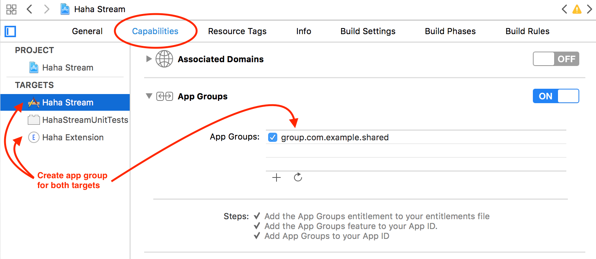

# Haha Stream

A native Hehestreams Apple TV/tvOS app. Need to know how to sideload to use it. 

# Device Support

Requires 4th generation Apple TV (the new one, for app support).

This has been tested on tvOS 10.1/Apple TV 4th gen.

# Build instructions

### Requirements:

- Xcode 8.2+
- Cocoapods
- Apple Developer account

### To build:

1. Clone repo
3. Open the .xcworkspace in Xcode
4. Select your team in the "Haha Stream" target settings
5. Build and run!

### To get "top shelf" behavior working:

1. For **both** the "Haha Stream" and "Haha Extension" targets (select the root of the xcodeproject to view)
2. Select the "Capabilities tab", and go to "App Groups"
2. Remove the existing app group and add your own (e.g. "group.com.myname.haha-stream.shared")

3. Open `AppProvider.swift` and change the `AppGroupName` value to the app group you came up with above
4. You may need to build and run the `Haha Extension` scheme manually to get it working.

# Questions?

Create an issue

# Acknowledgements

Thanks hehe.

There's another AppleTV app available here: [https://github.com/mwcurry/hehe]

[Additional acknowledgements](blob/master/Pods/Target%20Support%20Files/Pods-Haha%20Stream/Pods-Haha%20Stream-acknowledgements.markdown)
